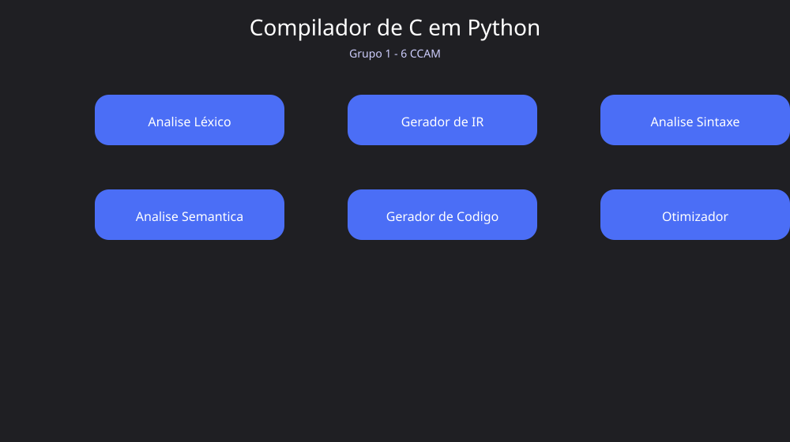
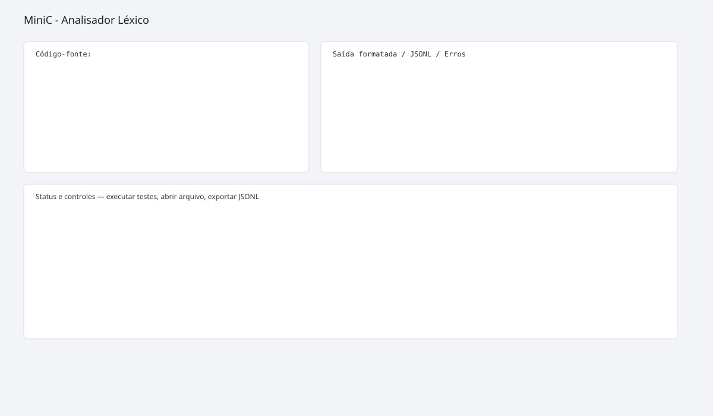

# MiniC em Python

Este diretório contém a implementação do compilador MiniC em Python. O trabalho está focado principalmente na etapa de análise léxica, com uma interface gráfica para facilitar testes e exportação dos resultados.

## Objetivo

O projeto identifica e classifica os elementos do código-fonte em tokens e detecta erros léxicos, por exemplo:

- símbolos inválidos
- strings não fechadas
- comentários de bloco sem fechamento
- literais mal formados

## Estrutura principal

```
src/
├── lexer/
│   ├── __init__.py
│   ├── __main__.py
│   ├── scanner.py
│   ├── token_types.py
│   ├── tokens.py
│   ├── errors.py
│   └── demo.py
├── parser/
├── semantic/
├── ast/
├── codegen/
├── ir/
├── optimizer/
└── __init__.py
```

## Launcher gráfico

Adicionei um launcher simples em `main.py` que fornece uma janela inicial com botões para as principais etapas do compilador:

- `Analise Léxico` — inicia o módulo `src.lexer` em um processo separado (abre a interface do lexer);
- `Gerador de IR`, `Analise Sintaxe`, `Analise Semantica`, `Gerador de Codigo`, `Otimizador` — atualmente exibem placeholders; podem ser ligados a pontos de entrada assim que implementados.

O launcher facilita testes locais e serve como ponto único para iniciar cada fase do projeto.

## Dependências

- Python 3.8+ (recomendado 3.10+)
- `tkinter` (está incluído na maioria das distribuições do Python; no Linux pode ser necessário instalar o pacote do sistema, por exemplo `sudo apt install python3-tk`).

## Como executar

Abra um terminal no diretório deste README (a raiz do projeto Python) e use um dos comandos abaixo:

Windows (com o lançador do Python):

```powershell
py -3 main.py
```

Ou, se `python` estiver no PATH:

```powershell
python main.py
```

Isso abre a janela launcher; clique em "Analise Léxico" para iniciar a interface do lexer.

Também é possível executar apenas o módulo do lexer diretamente:

```powershell
py -3 -m src.lexer
# ou
python -m src.lexer
```

## Interface gráfica do lexer

O módulo `src.lexer` contém uma interface em Tkinter que permite:

- executar os testes de demonstração;
- escrever código diretamente na interface;
- abrir um arquivo `.minic`, `.mc` ou `.c` para análise;
- abrir múltiplos arquivos ou uma pasta inteira contendo fontes MiniC;
- navegar entre análises carregadas por uma lista lateral;
- visualizar a saída formatada, o JSONL acadêmico e o JSONL de erros em abas separadas;
- exportar o JSONL em arquivo `.jsonl` e em lote;
- copiar o JSONL para a área de transferência;
- visualizar um resumo de status na interface.

## Testes

O repositório contém testes básicos para o scanner (pasta `tests/`). Para executar os testes com `pytest`:

```powershell
py -3 -m pytest -q
```

## Módulos do lexer (resumo)

- `token_types.py`: definição dos tipos de token
- `tokens.py`: modelo de `Token`
- `errors.py`: classes de erro e mensagens diagnósticas
- `scanner.py`: lógica de análise léxica (scanner)
- `demo.py`: códigos de teste/demonstração
- `__main__.py`: ponto de entrada do pacote `src.lexer` (contém a interface)

## Próximos passos

- implementar o parser e expor um entrypoint para `src.parser`;
- construir a árvore sintática (AST) e salvar exemplos de saída;
- implementar a análise semântica e gerar mensagens de diagnóstico;
- adicionar gerador de IR e gerador de código final;
- integrar o otimizador e criar modos de execução em pipeline.

Contribuições e melhorias são bem-vindas — abra uma issue ou envie um pull request com sugestões.

## Screenshots

Launcher (painel principal):



Interface do lexer (exemplo):


